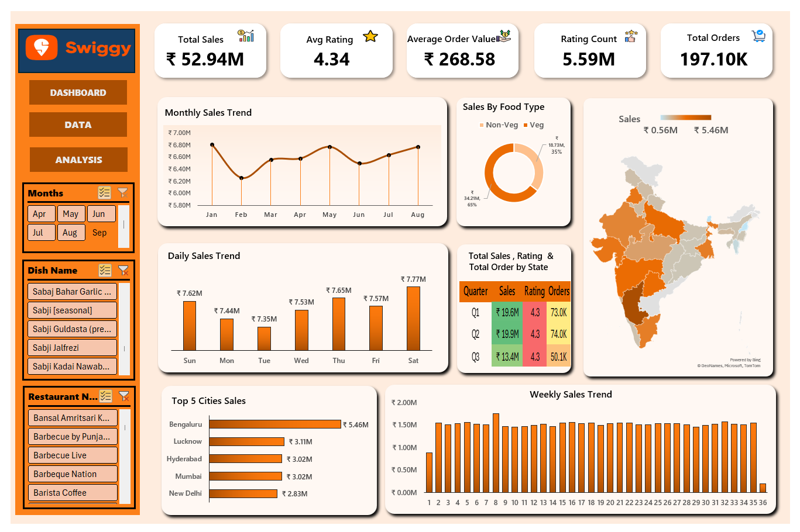

# 🍕 Swiggy Sales & Order Analytics Dashboard

An interactive **Excel Data Analytics Dashboard** designed to analyze revenue trends, customer ratings, order volumes, and regional performance across India for Swiggy.

---

## 📊 Dashboard Preview

---

## 🎯 Key Performance Indicators (KPIs)
| Metric | Value | Description |
| :--- | :---: | :--- |
| **Total Sales** | **₹ 52.94M** | Overall gross revenue generated across all orders |
| **Total Orders** | **197.10K** | Total number of completed food deliveries |
| **Average Order Value (AOV)** | **₹ 268.58** | Average spend per customer order |
| **Average Rating** | **4.34 ⭐** | Overall customer satisfaction score (based on **5.59M** ratings) |

---

## 📈 Key Visualizations & Insights
* **Monthly Sales Trend:** Tracks month-over-month revenue performance to highlight peak delivery seasons.
* **Daily & Weekly Sales Trends:** Analyzes order volume fluctuations across different days of the week to identify high-demand periods.
* **Sales by Food Type:** Comparative breakdown of **Veg vs. Non-Veg** consumer preferences.
* **Top 5 Cities by Sales:** Horizontal ranking of highest-grossing cities (e.g., *Bengaluru, Lucknow, Hyderabad*).
* **Geographic Analysis:** Interactive map and state-wise breakdown of total sales, customer ratings, and quarterly order distributions across India.

---

## 🛠️ Excel Tools & Techniques Used
* **Data Transformation:** Data cleaning and formatting using Power Query / Data tables.
* **Data Modeling:** Built dynamic **Pivot Tables** and **Pivot Charts** for real-time aggregation.
* **Interactive Controls:** Integrated custom **Slicers** for interactive filtering by:
  * **Months**
  * **Dish Name**
  * **Restaurant Name**
* **UI/UX & App-Like Experience:** Designed custom shape-based KPI cards and implemented **Sheet Protection** (with unlocked slicer controls) to prevent accidental chart edits and background cell selection.

---

## 🚀 How to Open & Use This Dashboard
1. Download the Excel workbook (`.xlsb`) from this repository.
2. Open the file in **Microsoft Excel (2016 or newer)**.
3. Use the **Slicers** on the left-hand panel to interactively filter the entire dashboard by specific months, dishes, or restaurant partners.
4. All charts and KPI cards will update dynamically based on your filter selections.
